## Question 1.1
In the LOverflow2.java program, when the input is lower or equal to 10, the program works fine, as expected. On the other hand, when the input is bigger than 10, the program throws an exception.

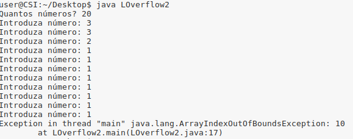

In the LOverflow2.py program, when the input is lower or equal to 10, the program works fine, as expected. , When the input is bigger than 10, the program crashes and throws an error of index out of range.

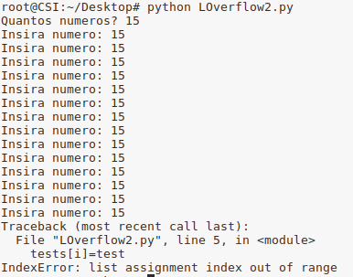

In the LOverflow2.cpp program, when the input is lower or equal to 10, the program works fine, as expected. On the other hand, when the input is bigger than 10, bufferoverflow happens, and since we are writting in the variable i, it loops and never ends.

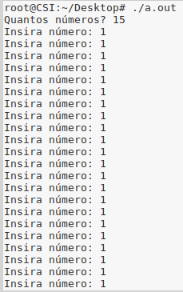

## Question 1.2
Similarly to the previous question, in the LOverflow3.java program, when the input value is lower than 10,  it behaves normal., when the input is greater than 10, it throws an exception.

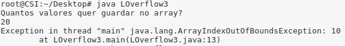

In the LOverflow3.py program, when the input is lower or equal to 10, the program works fine, as expected. , When the input is bigger than 10, the program crashes and throws an error of index out of range.

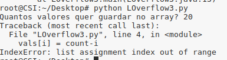

When the input for LOverflow3.cpp is lower than 10, works fine and you can recover the rigth value for the chosen position. when its greater than 10, if you want to recover a position greater than 10, it outputs "garbage" memory values, but when you want to recover a position lower than 10,  it outputs the rigth value. 

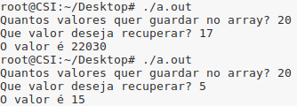

## Question 1.3
RootExploit.c uses the function gets to receive values from stdin, which isn't safe because it dosen't check if the input respects the size of the buffer and consequently values are writen in wrong memory places, and potentially change other variables of the program.
In this specific case, when we write something bigger than 4 (size of buffer), it changes the variable pass, giving us admin permitions.

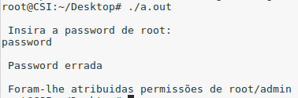

0-Simple.c, like RootExploit.c, uses gets. To exploit the vulnerability in this program we have to write input greater than 64, and consequently changing variable control and the program outpus the message YOU WIN.

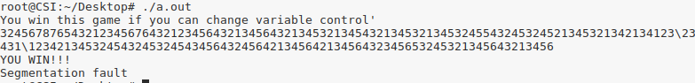

## Question 1.4
The ReadOverflow.c program, takes a size and a string as an argument and writes size first elements of the string.
When we give a size greater than the size of the string, we end up with information written in the memory.

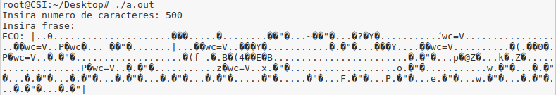

## Question 1.5
In this program we have to write 64 characters and 4 more characters, whose ASCII values are 61,62,63,64. Because of the formats little and big endian we have to write the characters in the opposite order. In conclusion, after writing 64 characters, we have to write dcba.

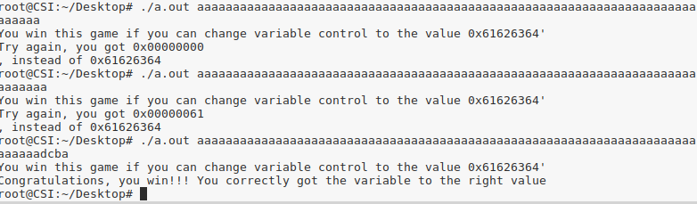

 ## Question 2.1
 The vulnerability in this program, is the usage of type size_t for parameters x and y.  Thigs coud go wrong in different ways, giving a negative x or y parameter, or a bigger number than the size_t can hold, causing overflow. Both this problems lead to segmentation fault.

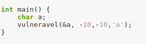

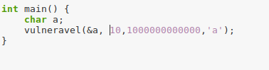

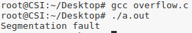

## Question 2.2

Similarly to the previous question, underflow.c uses type size_t. Although the problem for big and negative numbers was corrected by making use of a condition that checks the input value, it still has a problem when the input is zero.

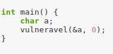

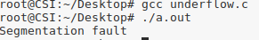

