## Question 1.1

Entering the last name Smith in the input box, we get the following output:

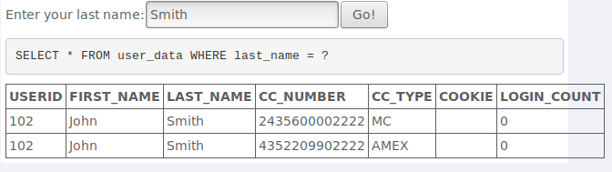

This returns the result of the query where last name is Smith. If we use a tautology, the query will return everything from the user_data table.

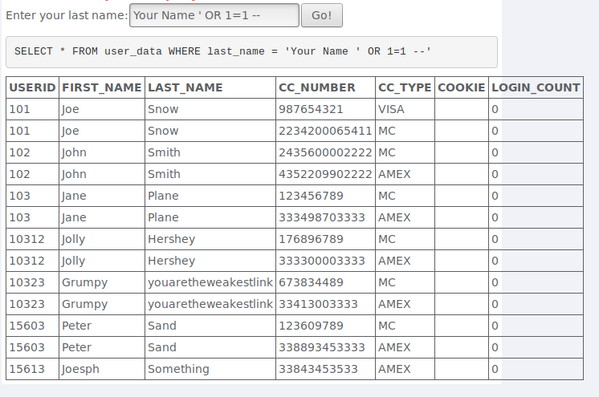

## Question 1.2

While experimenting, we can see that, depending on the place that we choose the variable station of the query changes.
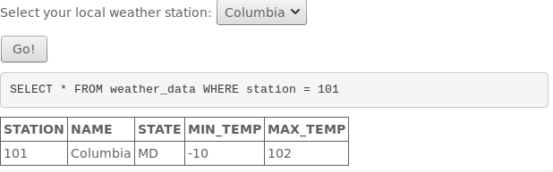

Using the Firefox development tools, we searched for the value for Columbia and we inserted a tautology to the value.

And we obtained the following result. In the image we can see the the value for the station changed.

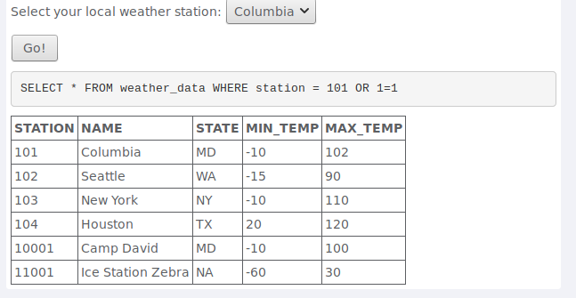

## Question 1.3

When we use the user 101, we obtain the information of an employee.

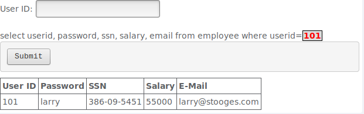 

If we insert the user id followed by an update query to the table employee, we can change the 
values of that table, including the salary.

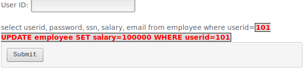

After changing the salary of the employee with the user id 101, we obtained the following result. We can see the the salary value as increased.

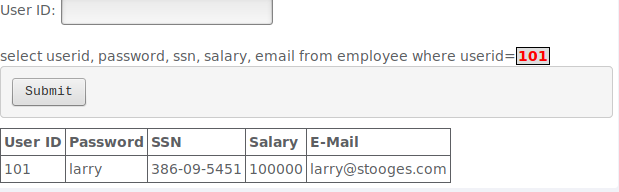

## Question 2.1

When we try to insert certain characters in the quantity field, the characters get changed.

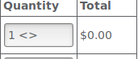

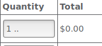

When we try to insert certain characters in the three digit access code or in the credit card number field, the characters don't get changed. So we use it to make the attack.

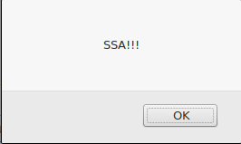

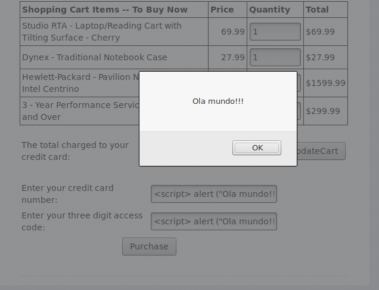

## Question 3.1

Using the WebGoat username ant the color red, we recovered the password for the WebGoat user.

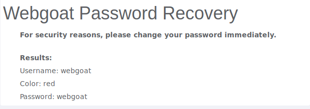

We want to recover the password from someone with higher privileges, so we thought Admin woul make a good choice.
Then we had to think of colours that could recover his password, and after some tries with the most common colour names, we arrived at green, wich was the answer.

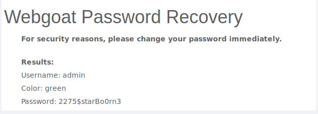 
