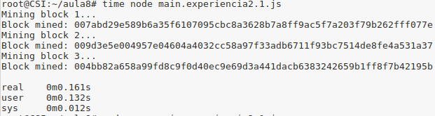
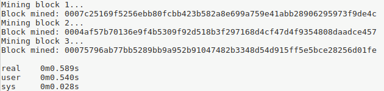
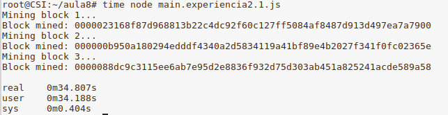

## Question 2.1

Mining difficulty *2*:
	

Mining difficulty *3*:
	

Mining difficulty *5*:	
	

As we can see above, as we increase the mining difficulty it takes more time to solve the "puzzle", wich is to calculate the hash value with as many initial zeros as the number of the difficulty. As we increase the number of the difficulty the number of solutions decreases. 

## Question 2.2

The "proof of work" algorithm used is the following, the calculus of a multiple of the last proof and nine.   

'''

	def proof_of_work(last_proof):
	  incrementor = last_proof + 1
	  
	  while not (incrementor % 9 == 0 and incrementor % last_proof == 0):
	    incrementor += 1
	  
	  return incrementor
'''
 

This isn't a good mining algorithm, first because its linear complexity is not suitable for mining, a good mining algorithm should require a high computional cost. Followed by the fact that there is no independence between the consecutive block proofs. This puts the last miner in advantage because he can pre-compute the following proof values.